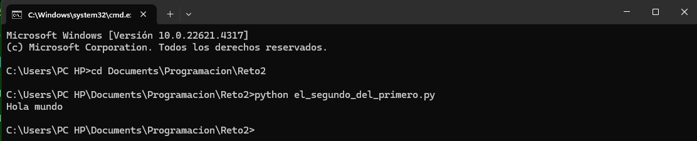
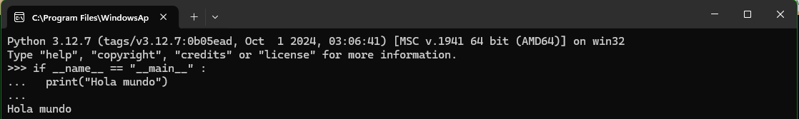
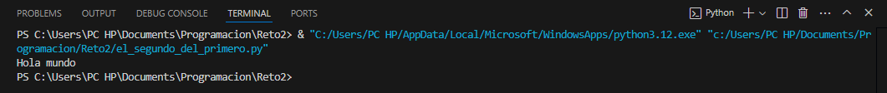

PNF_404_reto_2
=

Buenas! Este es mi primer repositorio, y voy a iniciarlo con el reto número 2 del curso de _Programación de computadores_.

El reto consiste en ejecutar el siguiente código:

```
if __name__ == "__main__" :
  print("Hola mundo")
```

En 3 sitios distintos: El terminal de Windows, el interprete de python y Visual Studio Code.

1. Terminal:
   

2. Interprete de python:
   

3. Visual Studio Code:
   
